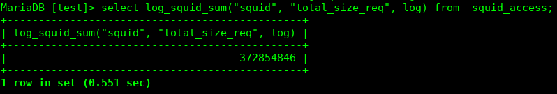
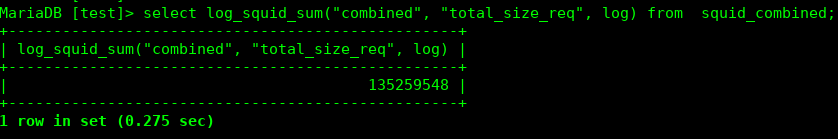
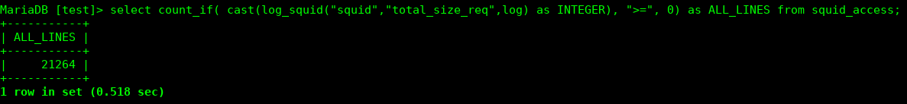
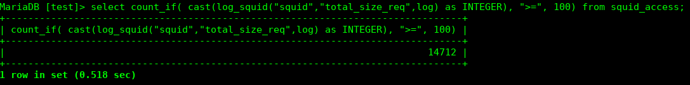
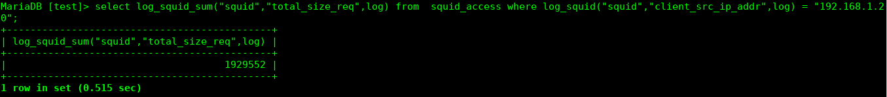
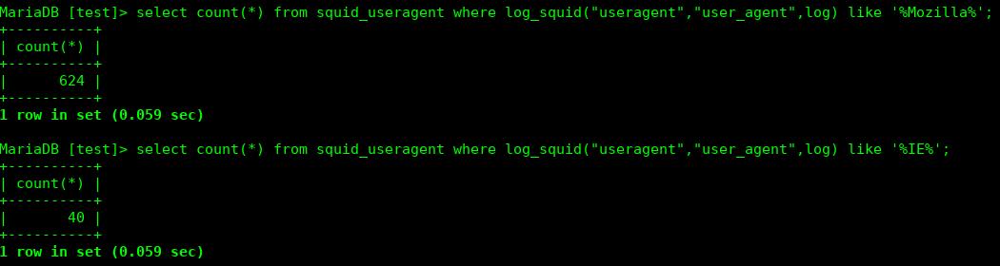

## liblogsquid

It's a library of utility functions to manipulate the registration line generated by the Squid-cache proxy. 
The main function *log_squid()*, allows us to retrieve only the information from the part of the log that interests us in a very simple way. 
The motivation to write these routines, in addition to the study and improvement of techniques, was due to the fact that this type of approach frees us from the SERDE routines in Java, usually written for data collection systems such as Apache Flume. 
So, very naturally, we can use these functions directly in SQL statements.

When we need new functions or have ideas about a new function, we will implement it in the project.

## Instructions

### To compile and install liblocation

git clone https://github.com/vcputtini/mysql-mariadb-udf-cpp   
cd libsquid   
make             
make install       

### Create UDF's

To create (register) the UDF's to used in the database, we will use the DDL's that are encoded in the __docs/create-functions.sql__ file.

__Line command:__ Using mysql command.

mysql [-p] [-D test] <  docs/create-funcs.sql

## References
* Syntax 
Type: Aggregation 
_INTEGER log_squid_sum(string,string,string);_ 
Arguments: 
1st: One these: squid | common | combined 
2nd: response_time | total_size_req 
3rd: Log line 
Comments: This function returns the sumatory of the values referring to the response_time and total_size_req. 

 

* Syntax 
Type: function
_string log_squid(string,string,string);_ 
Arguments: 
1st: One these: squid | common | combined | referrer | useragent 
2nd: Reserved Words: see list docs/reserved-words.txt 
3rd: Log line 
Comments: The function will always return the values in the string type.

* Supported Squid Log Formats 
Up to this point the *log_squid()* can handle the default formats of Squid's log types, as follows:  
Log Format: squid 
%ts.%03tu %6tr %>a %Ss/%03>Hs %<st %rm %ru %[un %Sh/%<a %mt 
UDF Reserved Word: squid  
Log Format: common 
%>a %[ui %[un [%tl] "%rm %ru HTTP/%rv" %>Hs %<st %Ss:%Sh 
UDF Reserved Word: common  
Log Format: combined 
%>a %[ui %[un [%tl] "%rm %ru HTTP/%rv" %>Hs %<st "%{Referer}>h" "%{User-Agent}>h" %Ss:%Sh 
UDF Reserved Word: combined  
Log Format: referrer 
%ts.%03tu %>a %{Referer}>h %ru 
UDF Reserved Word: referrer  
Log Format: useragent 
%>a [%tl] "%{User-Agent}>h" 
UDF Reserved Word: useragent 

* Reserved words to retrieve parts of the log 
The complete list of words reserved for use in the function can be found in the *docs/reserved-words.txt* file

* Usage Examples 
 
 
 

